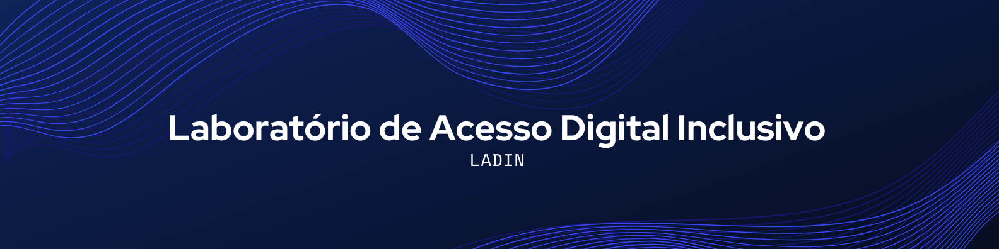

<h1 align="center"> 👩🏻‍💻 Laboratório de Acesso Digital Inclusivo - LADIN 👩🏻‍💻 </h1>

 ## 📋 **Índice**
- [📋 **Índice**](#-índice)
- [📄 **Apresentação**](#-apresentação)
- [📘 **Descrição do Projeto**](#-descrição-do-projeto)
- [🔗 **Links do Projeto**](#-links-do-projeto)
- [🤝 **Equipe**](#-equipe)

## 📄 **Apresentação**
O Laboratório de Acesso Digital Inclusivo é uma iniciativa desenvolvida por alunos do curso de Ciência da Computação do IFCE - Campus Maracanaú, como parte das atividades da disciplina de Gestão de Projetos, ministrada pelo professor Henrique Leitão.

## 📘 **Descrição do Projeto**

Este projeto visa criar um ambiente acessível e inclusivo para atender às necessidades dos alunos que dependem dos recursos da instituição para realizar suas atividades acadêmicas, promovendo inclusão digital e melhoria do desempenho acadêmico.

Atualmente, muitos laboratórios do IFCE são restritos a projetos específicos ou aulas práticas, limitando o acesso dos alunos fora desses horários. Essa realidade afeta diretamente estudantes que não possuem computador em casa, prejudicando seu desempenho acadêmico.

A proposta do LADIN é criar um espaço equipado com:
- Computadores modernos com os softwares essenciais.
- Conectividade de alta qualidade para acesso à internet.
- Funcionamento em horários ampliados, incluindo o período noturno, para atender às demandas de cursos vespertinos e noturnos.
- Sistema de reservas para organização eficaz do uso do espaço.

## 🔗 **Links do Projeto**
- [TAP (Termo de Abertura do Projeto)](https://docs.google.com/document/d/1O9r5r7e8V3WH0-ucugP4757m1yEZnyhl/edit?usp=drive_link&ouid=110889014359565880507&rtpof=true&sd=true)
- [EAP (Estrutura Analítica do Projeto)](https://lucid.app/lucidchart/bae221e9-ab8c-480e-9bd7-ee65caa0da00/edit?viewport_loc=-2911%2C-192%2C1715%2C763%2C0_0&invitationId=inv_f549d42c-f8ef-4972-b125-d00ad0a01c17)
- [Protótipo](https://www.canva.com/design/DAGVMLG1Uko/Bksul0sLCVgxmXefeZIsDQ/edit?utm_content=DAGVMLG1Uko&utm_campaign=designshare&utm_medium=link2&utm_source=sharebutton
)
- [Cronograma](https://docs.google.com/spreadsheets/d/1IvDq9Lpemmo6LC_NMC3wcX30eIf_8N0xp7IpPIaIpj0/edit?usp=sharing)
- [Dicionário do Cronograma](https://docs.google.com/spreadsheets/d/1OAGQIswH0lwU7GCOeJXdwObHn8UMwUeq/edit?usp=sharing&ouid=110889014359565880507&rtpof=true&sd=true)

## 🤝 **Equipe**
| [   Henrique Leitão ](https://github.com/henriqueleitaoprof)   <i>Orientador</i> | [   Débora Lima ](https://github.com/deboradls)   <i>Gestora</i> | [   Guilherme Pereira ](https://github.com/guiqwer)   <i>Colaborador</i> | [    André Alves ](https://github.com/andallves)   <i>Colaborador</i> | [    Asafe Duarte ](https://github.com/maripasa)   <i>Colaborador</i> | 
| :---: | :---: | :---: | :---: | :---: | 